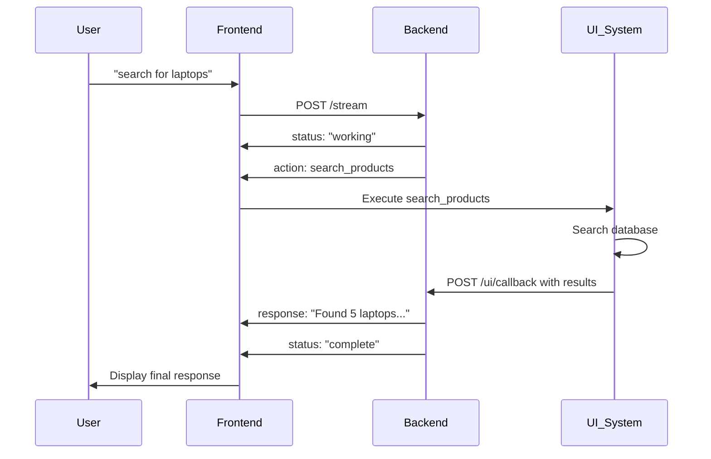

# Ecommerce Backend API Documentation

## Overview

This API provides a UI-first ecommerce agent with conversation memory and proper callback coordination. The agent triggers UI actions and waits for real UI results before providing informed responses.

**Base URL:** `http://localhost:8000`

## Authentication

Set the `OPENAI_API_KEY` environment variable for the backend to function.

---

## Core Chat Endpoints

### 1. Stream Chat (Primary Endpoint)

**Endpoint:** `POST /stream`  
**Description:** Main streaming chat endpoint with UI-first architecture and conversation memory.

#### Request Format
```json
{
  "message": "string",           // User's message
  "session_id": "string"         // Optional, defaults to "default"
}
```

#### Response Format (Streaming NDJSON)
The response is a stream of JSON objects separated by newlines. Each object has this format:

```json
{"event_type": "EVENT_TYPE", "data": {...}}
```

#### Event Types

**1. Status Events**
```json
{"event_type": "status", "data": {"status": "working", "message": "Processing your request..."}}
{"event_type": "status", "data": {"status": "waiting_ui", "message": "Waiting for UI results..."}}
{"event_type": "status", "data": {"status": "complete", "message": "Task completed"}}
{"event_type": "status", "data": {"status": "error", "message": "Error description"}}
{"event_type": "status", "data": {"status": "timeout", "message": "UI callback timeout"}}
```

**2. Action Events** 
```json
{
  "event_type": "action",
  "data": {
    "id": "session_id_0_timestamp",        // Unique action ID
    "function": "search_products",          // UI function to execute
    "params": {"query": "laptops"},         // Parameters for UI function
    "description": "Displaying search results for 'laptops'"
  }
}
```

**3. Response Events**
```json
{
  "event_type": "response",
  "data": {
    "text": "Agent's final response text",
    "final": true,
    "action_id": "session_id_0_timestamp",  // Optional, if triggered by UI callback
    "conversation_stats": {
      "exists": true,
      "total_messages": 6,
      "user_messages": 2,
      "agent_responses": 3,
      "ui_interactions": 1,
      "last_activity": "2025-06-30T20:35:05.798704",
      "first_message": "2025-06-30T20:35:03.179329"
    }
  }
}
```

#### Example Complete Flow

**Request:**
```bash
curl -X POST "http://localhost:8000/stream" \
  -H "Content-Type: application/json" \
  -d '{"message": "search for gaming laptops", "session_id": "user123"}'
```

**Response Stream:**
```json
{"event_type": "status", "data": {"status": "working", "message": "Processing your request..."}}
{"event_type": "action", "data": {"id": "user123_0_203456", "function": "search_products", "params": {"query": "gaming laptops"}, "description": "Displaying search results for 'gaming laptops'"}}
{"event_type": "status", "data": {"status": "waiting_ui", "message": "Waiting for UI results..."}}
// Stream waits here for UI callback...
{"event_type": "response", "data": {"text": "I found 3 gaming laptops...", "final": true, "action_id": "user123_0_203456"}}
{"event_type": "status", "data": {"status": "complete", "message": "Task completed with UI results"}}
```

---

### 2. UI Callback Endpoint

**Endpoint:** `POST /ui/callback`  
**Description:** UI sends action results back to agent after executing the requested action.

#### Request Format
```json
{
  "action_id": "user123_0_203456",    // ID from the action event
  "session_id": "user123",            // Same session ID
  "ui_data": {                        // Actual data from UI execution
    "products": [
      {
        "id": "prod_1",
        "name": "ASUS ROG Strix",
        "price": "$1299",
        "specs": "RTX 4060, 16GB RAM",
        "rating": 4.5,
        "image_url": "https://example.com/image1.jpg"
      },
      {
        "id": "prod_2", 
        "name": "MSI Gaming Laptop",
        "price": "$1199",
        "specs": "RTX 4050, 16GB RAM", 
        "rating": 4.3,
        "image_url": "https://example.com/image2.jpg"
      }
    ],
    "total_results": 15,
    "search_time": "0.2s"
  }
}
```

#### Response Format
```json
{
  "status": "success",
  "message": "UI callback processed successfully", 
  "action_id": "user123_0_203456"
}
```

#### Error Response
```json
{
  "status": "error",
  "message": "Unknown action ID"
}
```

---

## Non-Streaming Chat Endpoint

### Simple Chat

**Endpoint:** `POST /chat`  
**Description:** Non-streaming chat endpoint for simple integrations.

#### Request Format
```json
{
  "message": "string",
  "session_id": "string"  // Optional
}
```

#### Response Format
```json
{
  "response": "Agent's response text",
  "user_id": "anonymous", 
  "status": "success",
  "tools_available": 2,
  "conversation_stats": {...},
  "note": "For streaming responses, use /stream"
}
```

---

## Available UI Actions

The agent can trigger these UI functions:

### 1. Product Search
```json
{
  "function": "search_products",
  "params": {
    "query": "search term",
    "category": "optional category",
    "max_results": 10
  }
}
```

**Expected UI Response:**
```json
{
  "products": [
    {
      "id": "string",
      "name": "string", 
      "price": "string",
      "description": "string",
      "image_url": "string",
      "rating": 4.5,
      "specs": "string"
    }
  ],
  "total_results": 25,
  "search_time": "0.3s"
}
```

### 2. Navigation
```json
{
  "function": "navigate_to", 
  "params": {
    "page": "product_details",
    "product_id": "prod_123"
  }
}
```

**Expected UI Response:**
```json
{
  "success": true,
  "current_page": "product_details",
  "product_id": "prod_123",
  "page_loaded": true
}
```

---

## Conversation Management

### Get All Conversations

**Endpoint:** `GET /conversations`

#### Response Format
```json
{
  "conversations": {
    "session_1": {
      "exists": true,
      "total_messages": 10,
      "last_activity": "2025-06-30T20:35:05.798704"
    },
    "session_2": {
      "exists": true, 
      "total_messages": 5,
      "last_activity": "2025-06-30T19:22:15.123456"
    }
  },
  "total_sessions": 2,
  "active_sessions": 2
}
```

### Get Conversation History

**Endpoint:** `GET /conversations/{session_id}`

#### Response Format
```json
{
  "session_id": "user123",
  "summary": {
    "exists": true,
    "total_messages": 6,
    "user_messages": 2, 
    "agent_responses": 3,
    "ui_interactions": 1,
    "last_activity": "2025-06-30T20:35:05.798704",
    "first_message": "2025-06-30T20:35:03.179329"
  },
  "context": "Previous conversation context summary..."
}
```

### Clear Conversation

**Endpoint:** `DELETE /conversations/{session_id}`

#### Response Format
```json
{
  "status": "success",
  "message": "Conversation user123 cleared",
  "session_id": "user123"
}
```

### Cleanup Old Conversations

**Endpoint:** `POST /conversations/cleanup`

#### Response Format
```json
{
  "status": "success", 
  "message": "Cleaned up 3 old conversations",
  "cleaned_sessions": 3
}
```

---

## Health Check

**Endpoint:** `GET /health`

#### Response Format
```json
{
  "status": "ok",
  "openai_configured": true,
  "tools_loaded": 2,
  "agent_mode": "ui_first_with_callback_coordination",
  "memory_enabled": true
}
```

---

## UI Integration Flow

### 1. Complete Integration Flow



### 2. Frontend Implementation Example

**JavaScript Integration:**
```javascript
async function sendMessage(message, sessionId = 'default') {
  const response = await fetch('/stream', {
    method: 'POST',
    headers: { 'Content-Type': 'application/json' },
    body: JSON.stringify({ message, session_id: sessionId })
  });

  const reader = response.body.getReader();
  
  while (true) {
    const { done, value } = await reader.read();
    if (done) break;
    
    const chunk = new TextDecoder().decode(value);
    const lines = chunk.split('\n');
    
    for (const line of lines) {
      if (line.trim()) {
        const event = JSON.parse(line);
        await handleEvent(event);
      }
    }
  }
}

async function handleEvent(event) {
  switch (event.event_type) {
    case 'status':
      updateStatus(event.data.message);
      break;
      
    case 'action':
      await executeUIAction(event.data);
      break;
      
    case 'response':
      displayResponse(event.data.text);
      break;
  }
}

async function executeUIAction(action) {
  let uiData;
  
  switch (action.function) {
    case 'search_products':
      uiData = await searchProducts(action.params.query);
      break;
      
    case 'navigate_to':
      uiData = await navigateToPage(action.params.page, action.params);
      break;
  }
  
  // Send results back to backend
  await fetch('/ui/callback', {
    method: 'POST',
    headers: { 'Content-Type': 'application/json' },
    body: JSON.stringify({
      action_id: action.id,
      session_id: currentSessionId,
      ui_data: uiData
    })
  });
}
```

---

## Error Handling

### Common Error Responses

**Invalid Request:**
```json
{"event_type": "status", "data": {"status": "error", "message": "Invalid request format"}}
```

**UI Timeout:**
```json
{"event_type": "status", "data": {"status": "timeout", "message": "UI callback timeout - no response from UI"}}
```

**Unknown Action ID:**
```json
{"status": "error", "message": "Unknown action ID"}
```

### Timeout Configuration

- UI callbacks timeout after **30 seconds**
- Conversation sessions timeout after **24 hours**
- Maximum **50 messages** per conversation session

---

## Features

✅ **UI-First Architecture** - Agent only calls UI tools, waits for real results  
✅ **Conversation Memory** - Maintains context across interactions  
✅ **Proper Callback Coordination** - Stream waits for UI results before responding  
✅ **Session Management** - Multiple concurrent conversation sessions  
✅ **Real-time Streaming** - NDJSON streaming for live updates  
✅ **Error Handling** - Comprehensive error states and timeout protection  
✅ **Production Ready** - Clean API design with proper HTTP status codes

---

## Next Steps for UI Integration

1. **Implement Event Handling:** Parse the streaming NDJSON events
2. **UI Action Handlers:** Create functions for `search_products`, `navigate_to`, etc.
3. **Callback Integration:** Send UI results back via `/ui/callback`
4. **Session Management:** Track session IDs for conversation continuity
5. **Error Handling:** Handle timeouts and error states gracefully

The backend is now ready for production use with proper UI coordination! 🚀 